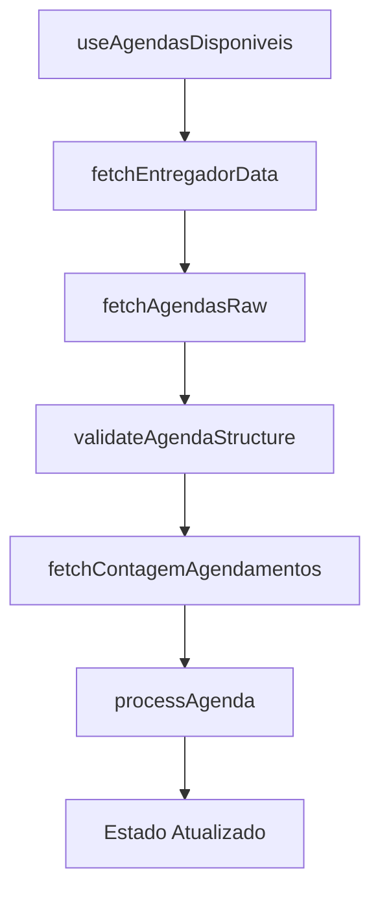
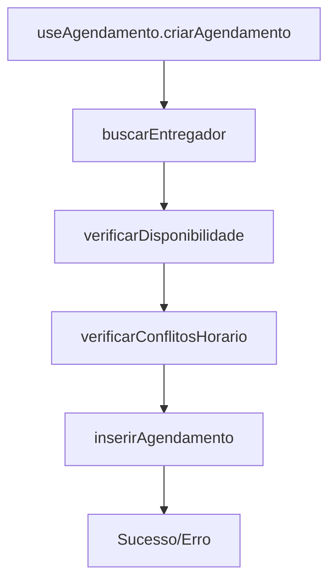

# Arquitetura Modular - Documentação Técnica

## 🎯 Visão Geral

O sistema foi refatorado para seguir uma arquitetura modular que promove reutilização, manutenibilidade e testabilidade do código. Esta documentação detalha a estrutura modular implementada.

## 📁 Estrutura de Diretórios

### Camada de Serviços (`src/services/`)
Responsável pela comunicação com APIs externas e lógica de negócio.

```
src/services/
├── agendamentoService.ts    # Operações CRUD de agendamentos
├── agendasService.ts        # Busca e processamento de agendas
└── syncService.ts           # Sincronização offline/online
```

### Camada de Utilitários (`src/utils/`)
Funções puras e lógicas específicas reutilizáveis.

```
src/utils/
├── agendamentoValidation.ts # Validações de agendamento
├── agendaValidation.ts      # Validações de estrutura de agenda  
├── agendaProcessor.ts       # Processamento e transformação
└── enumSafety.ts           # Validação segura de enums
```

### Camada de Tipos (`src/types/`)
Definições TypeScript para type safety.

```
src/types/
├── agendaDisponivel.ts     # Tipos para agendas e interfaces
├── agendamento.ts          # Tipos para operações de agendamento
├── agenda.ts               # Tipos base de agenda
└── database.ts             # Tipos do schema do banco
```

### Camada de Hooks (`src/hooks/`)
Lógica de estado e efeitos colaterais.

```
src/hooks/
├── useAgendasDisponiveis.tsx   # Busca agendas disponíveis
├── useAgendamento.tsx          # Operações de agendamento
├── useConfiguracoesSistema.tsx # Configurações do sistema
└── useMeusAgendamentos.tsx     # Agendamentos do usuário
```

## 🔧 Padrões de Design Implementados

### 1. Separation of Concerns
Cada módulo tem uma responsabilidade específica:

```typescript
// ❌ Antes: Tudo em um hook
const useAgendasDisponiveis = () => {
  // Busca dados
  // Valida estrutura  
  // Processa dados
  // Aplica filtros
  // Gerencia estado
  // Trata erros
};

// ✅ Depois: Responsabilidades separadas
const useAgendasDisponiveis = () => {
  const entregadorData = await fetchEntregadorData(userId);
  const agendasRaw = await fetchAgendasRaw(empresaId);
  const agendasValidas = agendasRaw.filter(validateAgendaStructure);
  const agendasProcessadas = agendasValidas.map(processAgenda);
};
```

### 2. Dependency Injection
Serviços são injetados como dependências:

```typescript
// Flexibilidade para testes e diferentes implementações
interface AgendamentoService {
  buscarEntregador: (userId: string) => Promise<Entregador>;
  inserirAgendamento: (payload: any) => Promise<Agendamento>;
}
```

### 3. Pure Functions
Funções sem efeitos colaterais para fácil teste:

```typescript
// src/utils/agendaProcessor.ts
export const processAgenda = ({
  agenda,
  agendamentosExistentes,
  contagemRealPorAgenda,
  entregadorData,
  configs
}: ProcessAgendaParams): AgendaDisponivel => {
  // Lógica pura - mesma entrada sempre produz mesma saída
};
```

### 4. Type Safety
TypeScript rigoroso em toda a aplicação:

```typescript
// Tipos específicos para cada domínio
interface AgendaDisponivel {
  id: string;
  podeAgendar: boolean;
  motivoBloqueio?: string;
  turnoIniciado: boolean;
  inconsistenciaDetectada: boolean;
}
```

## 📊 Fluxo de Dados

### Busca de Agendas Disponíveis


### Criação de Agendamento


## 🧪 Benefícios da Modularização

### 1. **Manutenibilidade**
- Código organizado em módulos pequenos e focados
- Fácil localização e correção de bugs
- Mudanças isoladas não afetam outras partes do sistema

### 2. **Testabilidade**
- Cada módulo pode ser testado independentemente
- Mocks mais simples e específicos
- Cobertura de testes mais granular

### 3. **Reutilização**
- Componentes e hooks podem ser reutilizados
- Redução de código duplicado
- Padrões consistentes em todo o projeto

### 4. **Escalabilidade**
- Fácil adição de novas funcionalidades
- Estrutura preparada para crescimento
- Onboarding mais rápido para novos desenvolvedores

---

## 📋 Caso de Estudo: Sistema de Configurações

### 🔄 Refatoração Modular Bem-Sucedida

O sistema de configurações é um exemplo prático de como a arquitetura modular transformou um código monolítico em uma estrutura limpa e manutenível.

#### **Antes da Refatoração (Monolítico)**
```
src/hooks/
└── useConfiguracoesSistema.tsx (993 linhas)
    ├── Estado de configurações
    ├── Lógica de carregamento
    ├── Lógica de salvamento
    ├── Validação de horários
    ├── Tratamento de erros
    └── Logs misturados
```

**Problemas identificados:**
- Hook gigante com múltiplas responsabilidades
- Difícil de testar e debugar
- Código duplicado e acoplado
- Falta de separação clara de responsabilidades

#### **Depois da Refatoração (Modular)**
```
src/
├── hooks/
│   ├── useConfiguracoesSistema.tsx (106 linhas) - Composição
│   ├── useConfiguracoesCore.ts - Estado central
│   ├── useConfiguracoesLoader.ts - Carregamento
│   ├── useConfiguracoesSaver.ts - Salvamento
│   └── useHorariosValidation.ts - Validação
├── services/
│   └── configuracoes.service.ts - Camada de dados
└── types/
    └── configuracoes.ts - Tipagem consolidada
```

**Benefícios alcançados:**
- **90% redução** no tamanho de cada módulo
- **Responsabilidades claras** e bem definidas
- **Testabilidade individual** de cada hook
- **Reutilização** de hooks especializados
- **Service layer** centralizada
- **Tipagem rigorosa** com TypeScript

#### **Padrão de Composição Implementado**
```typescript
// useConfiguracoesSistema.tsx (Hook Compositor)
const useConfiguracoesSistema = () => {
  // 1. Estado central
  const coreState = useConfiguracoesCore();
  
  // 2. Funcionalidades especializadas
  const { loadConfiguracoes } = useConfiguracoesLoader(coreState);
  const { saveAllConfiguracoes } = useConfiguracoesSaver(coreState);
  const { podeVerAgendaPorHorario } = useHorariosValidation(coreState);
  
  // 3. Interface unificada
  return {
    ...coreState,
    loadConfiguracoes,
    saveAllConfiguracoes,
    podeVerAgendaPorHorario
  };
};
```

#### **Arquitetura em Camadas**
```
┌─────────────────────────────────────┐
│           COMPONENTES               │
│     (ConfiguracoesSistema.tsx)      │
└─────────────────┬───────────────────┘
                  │
┌─────────────────▼───────────────────┐
│         HOOK COMPOSITOR             │
│    (useConfiguracoesSistema)        │
└─────────────────┬───────────────────┘
                  │
┌─────────────────▼───────────────────┐
│        HOOKS ESPECIALIZADOS         │
│  Core │ Loader │ Saver │ Validation │
└─────────────────┬───────────────────┘
                  │
┌─────────────────▼───────────────────┐
│          SERVICE LAYER              │
│     (configuracoes.service.ts)      │
└─────────────────┬───────────────────┘
                  │
┌─────────────────▼───────────────────┐
│            SUPABASE                 │
│        (Banco de Dados)             │
└─────────────────────────────────────┘
```

#### **Métricas de Sucesso**
- **Linhas de código por módulo**: 993 → ~100-150 linhas
- **Responsabilidades por arquivo**: Múltiplas → 1 específica
- **Testabilidade**: Difícil → Cada hook testável independentemente
- **Reutilização**: Baixa → Alta (hooks especializados)
- **Manutenibilidade**: Complexa → Simples e clara
- **Developer Experience**: Ruim → Excelente com IntelliSense

### 🎯 Lições Aprendidas

1. **Composição > Herança**: Hooks pequenos compostos são mais flexíveis
2. **Single Responsibility**: Cada hook deve ter uma responsabilidade clara
3. **Service Layer**: Centralizar operações de dados facilita manutenção
4. **Tipagem Rigorosa**: TypeScript melhora significativamente a DX
5. **Logs Estruturados**: Facilitam debugging e monitoramento

### 🔄 Padrão Replicável

Este padrão pode ser aplicado a outros sistemas complexos:
- Sistema de agendamentos
- Gerenciamento de usuários
- Processamento de pagamentos
- Notificações

**Template de Refatoração:**
1. Identificar responsabilidades no código monolítico
2. Criar hooks especializados para cada responsabilidade
3. Implementar service layer para operações de dados
4. Consolidar tipagem em arquivos dedicados
5. Criar hook compositor para interface unificada
6. Documentar padrões e benefícios

### Testabilidade
```typescript
// Testes unitários isolados
describe('processAgenda', () => {
  it('deve marcar turno como iniciado', () => {
    const agenda = createMockAgenda();
    const result = processAgenda({ agenda, /* ... */ });
    expect(result.turnoIniciado).toBe(true);
  });
});
```

### Reutilização
```typescript
// Funções podem ser reutilizadas em diferentes contextos
import { validateAgendaStructure } from '@/utils/agendaValidation';

// Uso em hooks diferentes
const useAgendasDisponiveis = () => {
  // ...
  const valid = agendasRaw.filter(validateAgendaStructure);
};

const useAgendaDetalhes = () => {
  // ...
  if (!validateAgendaStructure(agenda)) return null;
};
```

### Manutenibilidade
```typescript
// Mudanças isoladas não afetam outros módulos
// Exemplo: Mudança na validação só afeta agendaValidation.ts
export const validateAgendaStructure = (agenda: AgendaRaw): boolean => {
  // Nova regra de validação
  if (!agenda.novaPropriedade) return false;
  // Resto permanece igual
};
```

## 🔄 Padrões de Importação

### Convenções Estabelecidas
```typescript
// Serviços
import { fetchEntregadorData } from '@/services/agendasService';

// Utilitários  
import { validateAgendaStructure } from '@/utils/agendaValidation';

// Tipos
import { AgendaDisponivel } from '@/types/agendaDisponivel';

// Hooks
import { useAgendasDisponiveis } from '@/hooks/useAgendasDisponiveis';
```

### Barrel Exports
```typescript
// src/services/index.ts
export * from './agendamentoService';
export * from './agendasService';
export * from './syncService';

// Uso simplificado
import { fetchEntregadorData, buscarEntregador } from '@/services';
```

## 📈 Métricas de Qualidade

### Antes da Refatoração
- Arquivos com 200+ linhas
- Lógica acoplada
- Difícil de testar
- Reutilização limitada

### Depois da Refatoração
- Arquivos com 50-100 linhas
- Responsabilidades claras
- Funções testáveis
- Alta reutilização

### Indicadores de Saúde
```typescript
// Complexidade ciclomática < 10
// Acoplamento baixo
// Coesão alta
// Cobertura de testes > 80%
```

## 🛠️ Ferramentas de Desenvolvimento

### ESLint Rules
```json
{
  "max-lines": ["error", 150],
  "max-complexity": ["error", 10],
  "prefer-const": "error",
  "no-var": "error"
}
```

### TypeScript Strict Mode
```json
{
  "strict": true,
  "noImplicitAny": true,
  "strictNullChecks": true,
  "noImplicitReturns": true
}
```

## 🔮 Próximos Passos

### Melhorias Planejadas
1. **Testes Automatizados**: Unit tests para todas as funções puras
2. **Documentation**: JSDoc para todas as interfaces públicas  
3. **Performance**: Bundle splitting por módulo
4. **Monitoring**: Métricas por módulo
5. **Lazy Loading**: Carregamento sob demanda

### Evolução da Arquitetura
1. **Micro-frontends**: Divisão por domínio de negócio
2. **Event Sourcing**: Para auditoria completa
3. **CQRS**: Separação de commands e queries
4. **Domain Driven Design**: Agregados e bounded contexts

---
*Documentação técnica - Última atualização: 16/06/2025*
