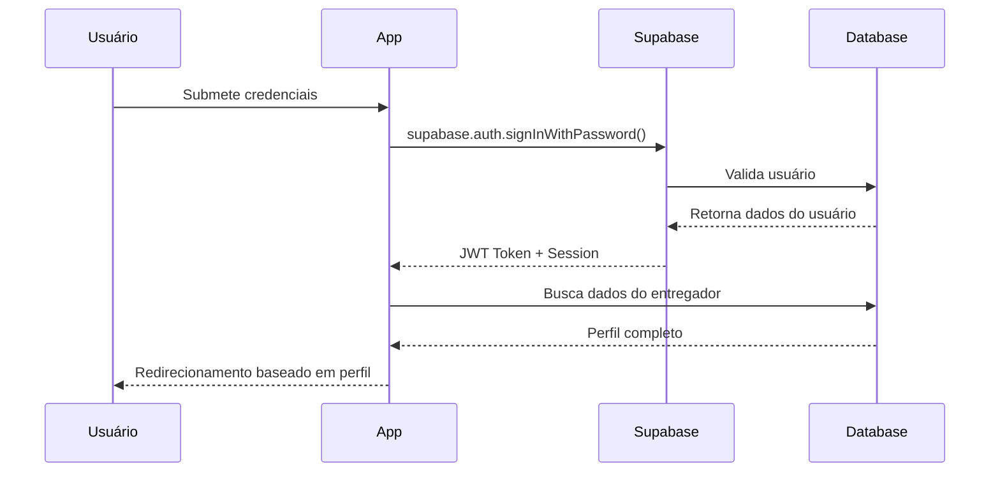

# Autenticação e Segurança

## 🔐 Visão Geral

O sistema utiliza Supabase Auth para gerenciamento completo de autenticação, com políticas de segurança baseadas em RLS (Row Level Security) e verificação de perfis.

## 🚪 Fluxo de Autenticação

### 1. Processo de Login


### 2. Verificação de Sessão
```typescript
// Hook useAuth
const checkSession = async () => {
  const { data: { session } } = await supabase.auth.getSession();
  
  if (session?.user) {
    // Buscar dados completos do entregador
    const { data: entregadorData } = await supabase
      .from('entregadores')
      .select('*, cidades(nome, estado)')
      .eq('user_id', session.user.id)
      .single();
    
    setUser(session.user);
    setEntregador(entregadorData);
  }
};
```

## 👤 Tipos de Usuário

### 1. Entregador
- **Perfil**: `entregador`
- **Status**: `pendente` → `aprovado` → `ativo`
- **Permissões**: 
  - Ver agendas da sua cidade
  - Criar/cancelar próprios agendamentos
  - Visualizar histórico pessoal

### 2. Administrador
- **Perfil**: `admin`
- **Status**: Sempre `aprovado`
- **Permissões**:
  - Acesso total ao sistema
  - Gestão de entregadores
  - Criação de agendas
  - Configurações globais

### 3. Processo de Cadastro de Administrador
- **Método**: Via Edge Function `cadastro-admin-empresa`
- **Requisitos**: Apenas Super Administradores podem cadastrar novos administradores
- **Campos obrigatórios**:
  - Empresa vinculada
  - Nome
  - Email (único no sistema)
  - Senha
- **Observações**:
  - Valores únicos para `telefone` e `cpf` são gerados automaticamente
  - O administrador é criado com status `aprovado`
  - O perfil é definido como `admin`

## 🛡️ Políticas de Segurança

### Row Level Security (RLS)

#### Política para Entregadores
```sql
-- Entregadores só veem dados da sua cidade
CREATE POLICY "entregadores_cidade_restriction" ON agendas
  FOR ALL TO authenticated
  USING (
    regiao_id IN (
      SELECT r.id FROM regioes r
      INNER JOIN entregadores e ON e.cidade_id = r.cidade_id
      WHERE e.user_id = auth.uid()
        AND e.status = 'aprovado'
    )
  );
```

#### Política para Administradores
```sql
-- Admins têm acesso total
CREATE POLICY "admin_full_access" ON agendas
  FOR ALL TO authenticated
  USING (
    EXISTS (
      SELECT 1 FROM entregadores
      WHERE user_id = auth.uid()
        AND perfil = 'admin'
    )
  );
```

### Função de Verificação Admin
```sql
CREATE OR REPLACE FUNCTION is_admin()
RETURNS BOOLEAN AS $$
BEGIN
  RETURN EXISTS (
    SELECT 1 FROM public.entregadores 
    WHERE user_id = auth.uid() AND perfil = 'admin'
  );
END;
$$ LANGUAGE plpgsql STABLE SECURITY DEFINER;
```

## 🔒 Implementação no Frontend

### 1. Hook de Autenticação
```typescript
export function useAuth() {
  const [user, setUser] = useState<User | null>(null);
  const [entregador, setEntregador] = useState<any>(null);
  const [loading, setLoading] = useState(true);

  // Verificar sessão ao carregar
  useEffect(() => {
    checkSession();
    
    // Listener para mudanças de autenticação
    const { data: { subscription } } = supabase.auth.onAuthStateChange(
      (event, session) => {
        if (session?.user) {
          setUser(session.user);
          fetchEntregadorData(session.user.id);
        } else {
          setUser(null);
          setEntregador(null);
        }
      }
    );

    return () => subscription.unsubscribe();
  }, []);

  const login = async (email: string, password: string) => {
    const { data, error } = await supabase.auth.signInWithPassword({
      email,
      password
    });
    
    if (error) throw error;
    return data;
  };

  const logout = async () => {
    await supabase.auth.signOut();
    setUser(null);
    setEntregador(null);
  };

  return { user, entregador, loading, login, logout };
}
```

### 2. Proteção de Rotas
```typescript
// AuthenticatedApp.tsx
export function AuthenticatedApp() {
  const { user, entregador, loading } = useAuth();

  if (loading) return <LoadingScreen />;
  
  if (!user) return <Navigate to="/login" />;
  
  // Verificar se é admin
  if (entregador?.perfil === 'admin') {
    return <AdminDashboard />;
  }
  
  // Verificar se entregador está aprovado
  if (entregador?.status !== 'aprovado') {
    return <PendingApprovalScreen />;
  }
  
  return <EntregadorDashboard />;
}
```

### 3. Componentes Condicionais
```typescript
// Mostrar diferentes interfaces baseado no perfil
{entregador?.perfil === 'admin' ? (
  <AdminSidebar />
) : (
  <EntregadorNavigation />
)}
```

## 🔑 Gestão de Tokens

### 1. Armazenamento Seguro
- Tokens JWT armazenados automaticamente pelo Supabase
- HTTPOnly cookies em produção
- LocalStorage apenas para desenvolvimento

### 2. Refresh Automático
```typescript
// Supabase gerencia automaticamente o refresh
supabase.auth.onAuthStateChange((event, session) => {
  if (event === 'TOKEN_REFRESHED') {
    console.log('Token renovado automaticamente');
  }
});
```

### 3. Expiração e Renovação
- Tokens expiram em 1 hora por padrão
- Refresh token válido por 30 dias
- Renovação automática em requisições

## 🚨 Tratamento de Erros de Autenticação

### 1. Erros Comuns
```typescript
const handleAuthError = (error: AuthError) => {
  switch (error.message) {
    case 'Invalid login credentials':
      toast.error('Email ou senha incorretos');
      break;
    case 'Email not confirmed':
      toast.error('Email não confirmado. Verifique sua caixa de entrada.');
      break;
    case 'Too many requests':
      toast.error('Muitas tentativas. Tente novamente em alguns minutos.');
      break;
    default:
      toast.error('Erro de autenticação');
      console.error('Auth error:', error);
  }
};
```

### 2. Redirecionamentos de Segurança
```typescript
// Middleware para proteger rotas admin
const RequireAdmin = ({ children }: { children: ReactNode }) => {
  const { entregador } = useAuth();
  
  if (entregador?.perfil !== 'admin') {
    return <Navigate to="/dashboard" />;
  }
  
  return children;
};
```

## 🔍 Auditoria e Logs

### 1. Logs de Autenticação
```typescript
// Log eventos importantes
useEffect(() => {
  const { data: { subscription } } = supabase.auth.onAuthStateChange(
    (event, session) => {
      console.log('Auth event:', event, 'User:', session?.user?.email);
      
      // Em produção, enviar para serviço de logging
      if (event === 'SIGNED_IN') {
        analytics.track('user_login', {
          user_id: session?.user?.id,
          timestamp: new Date().toISOString()
        });
      }
    }
  );
  
  return () => subscription.unsubscribe();
}, []);
```

### 2. Rastreamento de Ações Sensíveis
```typescript
const auditLog = async (action: string, details: any) => {
  await supabase.from('audit_logs').insert({
    user_id: user?.id,
    action,
    details,
    ip_address: await getClientIP(),
    user_agent: navigator.userAgent,
    timestamp: new Date().toISOString()
  });
};
```

## 🛠️ Configurações de Segurança

### 1. Supabase Auth Settings
```typescript
// Configurações recomendadas no dashboard Supabase
{
  "SITE_URL": "https://yourdomain.com",
  "REDIRECT_URLS": ["https://yourdomain.com/auth/callback"],
  "JWT_EXPIRY": 3600,
  "REFRESH_TOKEN_ROTATION": true,
  "SECURITY_CAPTCHA_ENABLED": true
}
```

### 2. Headers de Segurança
```typescript
// Em produção, configurar headers HTTP
{
  "Content-Security-Policy": "default-src 'self'",
  "X-Frame-Options": "DENY",
  "X-Content-Type-Options": "nosniff",
  "Strict-Transport-Security": "max-age=31536000"
}
```

## 🔄 Fluxo de Recuperação de Senha

### 1. Solicitação de Reset
```typescript
const resetPassword = async (email: string) => {
  const { error } = await supabase.auth.resetPasswordForEmail(email, {
    redirectTo: `${window.location.origin}/reset-password`
  });
  
  if (error) throw error;
  
  toast.success('Email de recuperação enviado!');
};
```

### 2. Atualização de Senha
```typescript
const updatePassword = async (newPassword: string) => {
  const { error } = await supabase.auth.updateUser({
    password: newPassword
  });
  
  if (error) throw error;
  
  toast.success('Senha atualizada com sucesso!');
};
```

---
*Última atualização: 30/05/2025*
