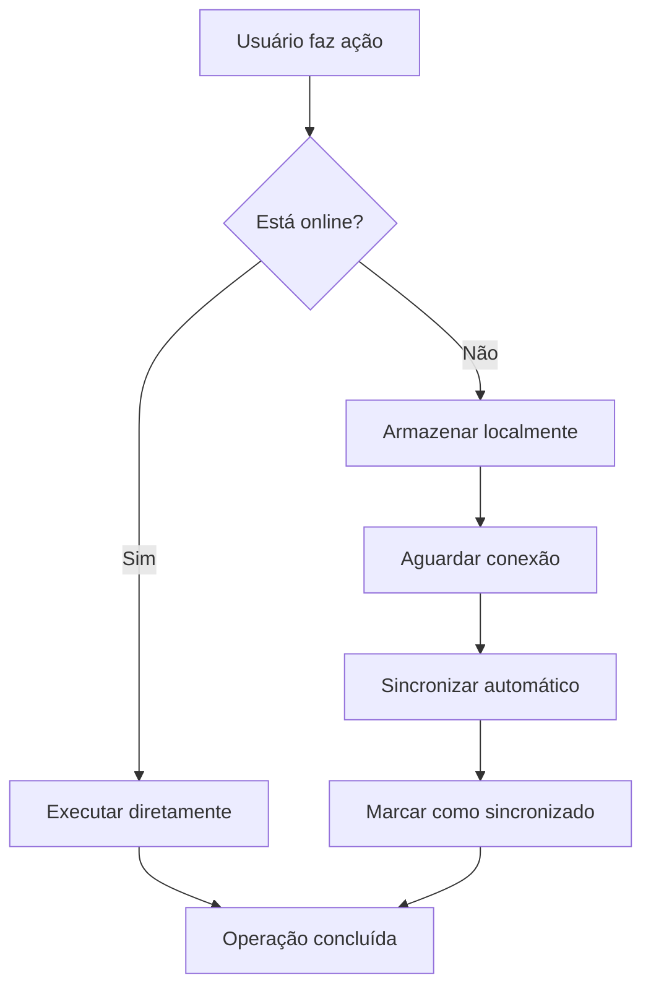

# Sistema de Sincronização - Documentação Técnica

## 🎯 Visão Geral

O Sistema de Sincronização permite que o aplicativo funcione offline e sincronize automaticamente quando a conexão for restabelecida, garantindo uma experiência fluida para os usuários.

## 🔧 Componentes Principais

### 1. Hook useOnlineStatus
```typescript
// Detecta status de conexão
const { isOnline } = useOnlineStatus();
```

**Funcionalidades:**
- Detecta mudanças de conectividade
- Eventos de online/offline
- Estado reativo para componentes

### 2. SyncService
```typescript
// Serviço de sincronização
const syncService = {
  syncData: () => Promise<boolean>,
  getPendingSyncCount: () => Promise<number>,
  storePendingOperation: (operation) => Promise<void>
};
```

**Operações Suportadas:**
- Armazenamento de operações pendentes
- Sincronização em lote
- Contagem de itens pendentes
- Retry automático em falhas

### 3. Componente SyncStatus
Interface visual que mostra:
- Status de conexão (online/offline)
- Número de itens pendentes
- Botão de sincronização manual
- Indicadores visuais

## 📊 Fluxo de Sincronização



## 🗄️ Armazenamento Local

### IndexedDB
```typescript
// Estrutura do banco local
interface PendingOperation {
  id: string;
  type: 'agendamento' | 'cancelamento' | 'update';
  data: any;
  timestamp: number;
  attempts: number;
}
```

### Tabelas Locais
- `pending_operations`: Operações aguardando sincronização
- `sync_metadata`: Metadados de sincronização
- `cache_data`: Cache de dados frequentes

## ⚙️ Configurações

### Retry Policy
```typescript
const retryConfig = {
  maxAttempts: 3,
  backoffDelay: 1000, // 1s, 2s, 4s
  timeoutMs: 10000
};
```

### Sync Intervals
- **Automático**: A cada mudança de status online
- **Periódico**: A cada 30 segundos quando online
- **Manual**: Via botão do usuário

## 🎨 Interface Visual

### Estados do SyncStatus
1. **Online + Sincronizado**: Ícone verde, sem badge
2. **Online + Pendente**: Ícone verde + badge com contador
3. **Offline**: Ícone amarelo + tooltip explicativo
4. **Sincronizando**: Ícone rotativo

### Feedback para Usuário
```typescript
// Notificações automáticas
toast.success("Sincronização concluída!");
toast.error("Erro ao sincronizar. Tentando novamente...");
toast.info("Você está offline. Dados serão sincronizados automaticamente.");
```

## 🧪 Testes

### Cenários de Teste
1. **Conectividade**: Simular perda/recuperação de rede
2. **Operações Offline**: Fazer agendamentos sem internet
3. **Sincronização**: Verificar upload automático
4. **Conflitos**: Testar operações conflitantes
5. **Falhas**: Simular falhas de API

### Ferramentas de Debug
```javascript
// Console commands
syncService.getPendingSyncCount().then(console.log);
syncService.debugPendingOperations();
localStorage.getItem('sync_metadata');
```

## 📊 Monitoramento

### Métricas
- **Taxa de Sucesso**: % de sincronizações bem-sucedidas
- **Tempo Offline**: Duração média offline por usuário
- **Operações Pendentes**: Número médio de operações pendentes
- **Tempo de Sync**: Duração média de sincronização

### Logs
```typescript
logger.info('Sync iniciada', { pendingCount: 5 }, 'SYNC');
logger.error('Sync falhou', { error, attempt: 2 }, 'SYNC');
logger.success('Sync concluída', { processed: 5 }, 'SYNC');
```

## ⚠️ Limitações e Considerações

### Limitações Atuais
- Apenas operações básicas (CRUD)
- Sem resolução automática de conflitos
- Cache limitado por quota do browser
- Sem sincronização bi-direcional completa

### Considerações de Performance
- Batch operations para eficiência
- Compressão de dados quando possível
- Limpeza automática de dados antigos
- Throttling de tentativas de sync

### Segurança
- Dados sensíveis apenas em cache temporário
- Validação no servidor independente
- Tokens de auth persistidos com segurança
- Limpeza automática em logout

## 🔄 Roadmap Futuro

### Melhorias Planejadas
1. **Resolução de Conflitos**: Sistema automático para conflitos
2. **Sync Inteligente**: Apenas dados modificados
3. **Background Sync**: Via Service Worker
4. **Compression**: Reduzir tamanho dos dados
5. **Real-time**: WebSocket para updates instantâneos

### Integração com PWA
- Service Worker para background sync
- Cache strategies avançadas
- Notificações push quando online
- Update automático da aplicação

---
*Documentação técnica - Última atualização: 16/06/2025*
