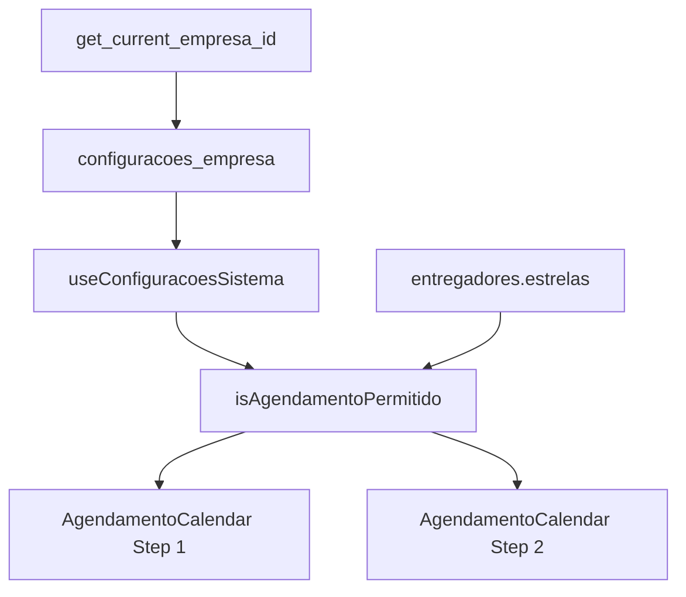

# Sistema de Horários Específicos - Documentação Técnica

## 🎯 Arquitetura do Sistema

### Componentes Principais



### Fluxo de Validação

1. **Carregamento de Configurações**
   - Hook `useConfiguracoesSistema` carrega configs da empresa
   - Retry automático em caso de falha
   - Cache das configurações na sessão

2. **Validação de Horário**
   - Função `isAgendamentoPermitido(data, horaInicio)`
   - Compara horário atual com horário de liberação específico
   - Retorna `{ permitido: boolean, motivo?: string }`

3. **Aplicação na Interface**
   - Step 1: Filtra datas disponíveis visualmente
   - Step 2: Valida novamente ao selecionar turno
   - Feedback consistente em ambas as etapas

## 🔧 Implementação Técnica

### Hook useConfiguracoesSistema

```typescript
interface ConfiguracoesReturn {
  configs: ConfiguracoesSistema | null;
  loading: boolean;
  hasError: boolean;
  podeVerAgendaPorHorario: (estrelas: number, data: string, hora: string) => ValidationResult;
  isAgendamentoPermitido: (data: string, hora: string) => ValidationResult;
}
```

**Características:**
- Retry automático (3 tentativas)
- Timeout de 10 segundos
- Logs categorizados para debug
- Fallback para configurações padrão

### Função SQL get_current_empresa_id

```sql
CREATE OR REPLACE FUNCTION get_current_empresa_id()
RETURNS UUID
LANGUAGE SQL
SECURITY DEFINER
STABLE
AS $$
  SELECT e.empresa_id 
  FROM entregadores e 
  WHERE e.user_id = auth.uid()
  LIMIT 1;
$$;
```

**Características:**
- `SECURITY DEFINER`: Executa com privilégios do owner
- `STABLE`: Resultado não muda durante a transação
- Evita problemas de RLS recursivo

### Políticas RLS

```sql
-- Política para leitura de configurações
CREATE POLICY "Users can read own company configs"
ON configuracoes_empresa FOR SELECT
TO authenticated
USING (empresa_id = get_current_empresa_id());
```

## 📊 Configurações por Nível de Estrelas

### Horários Padrão

| Estrelas | Horário Liberação | Diferença |
|----------|-------------------|-----------|
| ⭐⭐⭐⭐⭐ | 08:00 | Base |
| ⭐⭐⭐⭐ | 08:45 | +45min |
| ⭐⭐⭐ | 09:20 | +1h20min |
| ⭐⭐ | 10:00 | +2h |
| ⭐ | 10:30 | +2h30min |

### Personalização por Empresa

```sql
-- Exemplo: Empresa com horários mais restritivos
UPDATE configuracoes_empresa SET
  horario_liberacao_5_estrelas = '06:00:00',
  horario_liberacao_4_estrelas = '07:00:00',
  horario_liberacao_3_estrelas = '08:00:00',
  horario_liberacao_2_estrelas = '09:00:00',
  horario_liberacao_1_estrela = '10:00:00'
WHERE empresa_id = 'empresa-id';
```

## 🐛 Debug e Troubleshooting

### Logs Categorizados

```javascript
// Configurações
logger.info('Configs carregadas', data, 'CONFIGURACOES_SISTEMA');

// Validação específica do Adelson
logger.info('Debug Adelson', data, 'DEBUG_ADELSON');

// Filtros de agenda
logger.info('Filtro aplicado', data, 'AGENDAS_FILTRO');
```

### Checklist de Diagnóstico

1. **Configurações Carregando?**
   ```javascript
   console.log('Configs:', configs);
   console.log('Loading:', loading);
   console.log('Has Error:', hasError);
   ```

2. **Função SQL Funcionando?**
   ```sql
   SELECT get_current_empresa_id();
   -- Deve retornar UUID da empresa
   ```

3. **Políticas RLS Ativas?**
   ```sql
   SELECT * FROM configuracoes_empresa 
   WHERE empresa_id = get_current_empresa_id();
   ```

4. **Validação de Horário?**
   ```javascript
   const result = isAgendamentoPermitido('2025-06-15', '09:00:00');
   console.log(result.permitido, result.motivo);
   ```

### Problemas Comuns

#### 1. Configurações sempre null
**Causa**: RLS bloqueando acesso ou função SQL quebrada
**Solução**: Verificar políticas RLS e função `get_current_empresa_id()`

#### 2. Sistema não respeita horários
**Causa**: `habilitarPriorizacaoHorarios` desabilitado ou configurações não carregadas
**Solução**: Verificar valor da configuração e logs de carregamento

#### 3. Interface inconsistente
**Causa**: Validação não aplicada no Step 1
**Solução**: Confirmar uso de `isAgendamentoPermitido()` em ambos os steps

## 📈 Métricas e Monitoramento

### KPIs do Sistema

1. **Taxa de Sucesso de Carregamento**
   - Configurações carregadas / Tentativas totais
   - Meta: > 99%

2. **Tempo de Resposta**
   - Tempo médio para carregar configurações
   - Meta: < 2 segundos

3. **Taxa de Retry**
   - Quantas vezes o retry foi necessário
   - Meta: < 5%

### Logs de Performance

```javascript
// Início do carregamento
logger.time('configs-load');

// Fim do carregamento
logger.timeEnd('configs-load');
logger.info('Performance', {
  loadTime: performance.now() - startTime,
  retryCount: retryAttempts,
  success: !hasError
}, 'PERFORMANCE');
```

## 🚀 Roadmap Futuro

### Melhorias Planejadas

1. **Cache Persistente**
   - localStorage para configurações
   - Reduzir requests ao banco
   - Melhor performance offline

2. **Notificações em Tempo Real**
   - WebSocket para mudanças de configuração
   - Notificar quando horários são liberados
   - Updates automáticos na interface

3. **Dashboard de Configurações**
   - Interface admin para ajustar horários
   - Preview do impacto das mudanças
   - Histórico de alterações

4. **Métricas Avançadas**
   - Analítica de uso por horário
   - Patterns de agendamento
   - Otimização automática de horários

### Considerações Técnicas

1. **Escalabilidade**
   - Sistema suporta milhares de entregadores
   - Configurações por empresa isoladas
   - Performance não degrada com crescimento

2. **Manutenibilidade**
   - Código bem documentado
   - Logs estruturados
   - Testes automatizados (futuro)

3. **Flexibilidade**
   - Configurações dinâmicas
   - Múltiplos sistemas de horário
   - Customização por empresa

---
*Documentação técnica - Última atualização: 14/06/2025*
