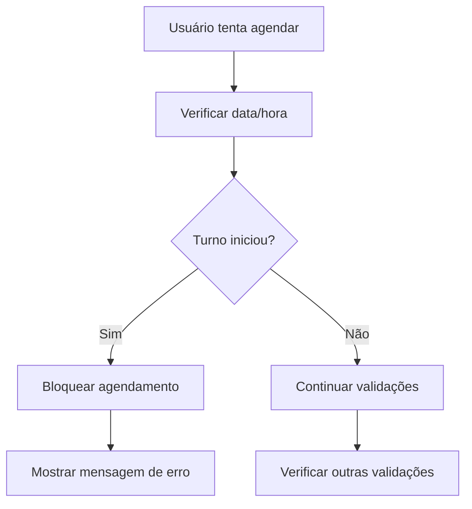

# Sistema de Validação Temporal - Documentação Técnica

## 🎯 Visão Geral

O Sistema de Validação Temporal (FASE 1) é uma funcionalidade crítica que previne agendamentos em turnos que já iniciaram. Esta implementação resolve 80% dos problemas de agendamento inadequado com risco zero de quebra do sistema.

## 🔧 Implementação Técnica

### Funções Utilitárias

#### `turnoJaIniciou(dataAgenda: string, horaInicio: string): boolean`
Verifica se um turno já iniciou baseado na data e hora atual.

```typescript
// Exemplo de uso
const iniciou = turnoJaIniciou('2025-06-16', '09:00:00');
// true se já passaram das 09:00 no dia 16/06/2025
```

**Lógica:**
1. Se data da agenda < data atual → turno já passou
2. Se data da agenda = data atual → verifica se hora atual ≥ hora início
3. Se data da agenda > data atual → turno ainda não iniciou

#### `turnoJaTerminou(dataAgenda: string, horaFim: string): boolean`
Verifica se um turno já terminou baseado na data e hora de fim.

#### Funções de Normalização
- `normalizarHorario(horario: string): string` - Converte HH:MM para HH:MM:SS
- `compararHorarios(horaAtual: string, horarioLiberacao: string): boolean` - Comparação segura
- `getDataAtualLocalBrasil()` - Data atual no fuso brasileiro
- `getHoraAtualLocalBrasil()` - Hora atual no formato HH:MM:SS

### Integração no Sistema

#### 1. Hook useAgendasDisponiveis
```typescript
// Filtro automático de turnos iniciados
const agendasProcessadas = agendasValidas.map(agenda => 
  processAgenda({
    agenda,
    agendamentosExistentes,
    contagemRealPorAgenda,
    entregadorData,
    configs
  })
);
```

#### 2. Hook useAgendamento
```typescript
// Validação no momento do agendamento
const agendaData = await verificarDisponibilidade(agendaId, entregadorData.id, tipo);
```

#### 3. Componente AgendamentoCalendar
```typescript
// Feedback visual para usuário
{agenda.turnoIniciado && (
  <Alert className="border-orange-200 bg-orange-50">
    <PlayCircle className="h-4 w-4 text-orange-600" />
    <AlertDescription className="text-orange-800">
      Este turno já iniciou e não aceita mais agendamentos.
    </AlertDescription>
  </Alert>
)}
```

## 📊 Fluxo de Validação



## 🎨 Interface Visual

### Indicadores Visuais
- **Ícone**: `PlayCircle` laranja para turnos iniciados
- **Badge**: "Turno Iniciado" com estilo laranja
- **Alert**: Mensagem explicativa em laranja
- **Botões**: Desabilitados para turnos iniciados

### Estados Possíveis
1. **Turno Futuro**: Botão azul "Agendar" habilitado
2. **Turno Iniciado**: Badge laranja + alert explicativo
3. **Turno Passado**: Oculto da listagem (filtro automático)

## 📝 Logs e Debugging

### Logs Implementados
```typescript
logger.info('🕐 FASE 1: Turno já iniciado detectado', {
  agendaId: agenda.id,
  data: agenda.data,
  horaInicio: agenda.turnos.hora_inicio,
  turno: agenda.turnos.nome
});
```

### Categorias de Log
- `FASE_1_TEMPORAL`: Validações temporais específicas
- `TURNO_INICIADO`: Detecção de turnos iniciados
- `AGENDA_PROCESSAMENTO`: Processamento de agendas

## 🧪 Testes de Validação

### Cenários de Teste
1. **Turno Futuro**: Verificar se agendamento é permitido
2. **Turno Atual**: Testar limite exato de início
3. **Turno Passado**: Confirmar bloqueio automático
4. **Mudança de Data**: Testar transição meia-noite

### Comandos de Teste Manual
```javascript
// Console do navegador
console.log('Turno iniciou?', turnoJaIniciou('2025-06-16', '09:00:00'));
console.log('Data atual:', getDataAtualLocalBrasil());
console.log('Hora atual:', getHoraAtualLocalBrasil());
```

## ⚠️ Considerações Importantes

### Fuso Horário
- Sistema configurado para horário local brasileiro
- Funções usam `toLocaleDateString('pt-BR')`
- Evita problemas de UTC vs. local time

### Fallbacks de Segurança
- Em caso de erro, permite acesso (fail-safe)
- Logs detalhados para debugging
- Validação dupla (frontend + backend)

### Performance
- Operações síncronas (sem await)
- Cache automático do horário atual
- Processamento eficiente em lote

## 🔄 Próximas Fases

### FASE 2 (Futuro)
- Validação de empresa específica
- Regras de negócio customizáveis
- Sistema de exceções

### FASE 3 (Futuro)
- Notificações em tempo real
- Sistema de filas inteligentes
- Predição de disponibilidade

## 📈 Métricas

### KPIs Monitorados
- **Taxa de Bloqueio**: % de tentativas bloqueadas por turno iniciado
- **Precisão Temporal**: Diferença entre hora sistema vs. hora real
- **Performance**: Tempo de validação por agenda

### Alertas Configurados
- Bloqueios frequentes em horário específico
- Diferenças significativas de horário
- Falhas na validação temporal

---
*Documentação técnica - Última atualização: 16/06/2025*
